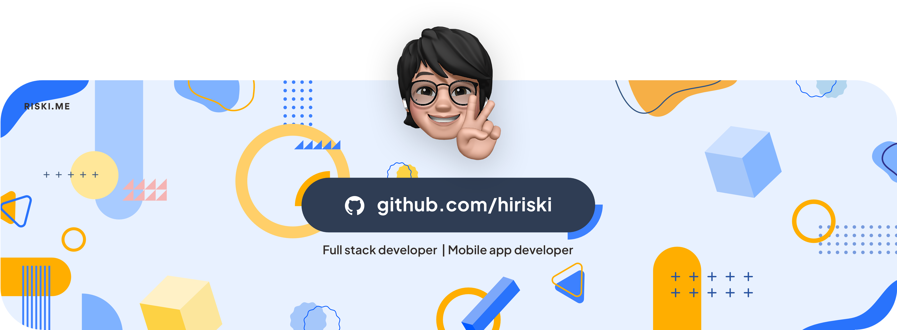
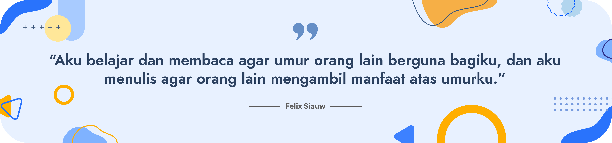
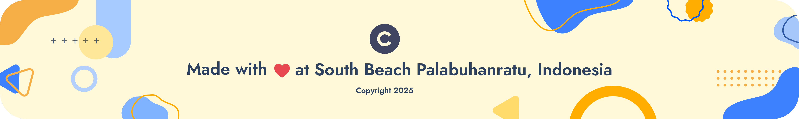

<!-- header banner -->

  <picture>
    <source media="(prefers-color-scheme: dark)" srcset="./banners/banner-header-dark.png">
    
  </picture>

### Hi there, I'm Riski! 👋

I’m a Full Stack Developer with over 5 years of experience, passionate about building fast, responsive, and user-friendly web applications. With expertise in [React.js](https://react.dev/), [Next.js](https://nextjs.org/), [Vue.js](https://vuejs.org/), [Laravel](https://laravel.com/), [Node.JS](https://nodejs.org/) and [TypeScript](https://www.typescriptlang.org/), I specialize in crafting high-performance interfaces that enhance user experience snd drive business growth.

### 👨🏻‍💻 What i do
I love turning ideas into real stuff. My journey in web and mobile app development—especially with [React Native](https://reactnative.dev/)—has taken me through all kinds of projects, from simple landing pages (SPA) to more complex web apps. Whether I’m working solo or with a team, I really enjoy building apps that are interactive and user-friendly. Of course, I always try to keep the code clean, efficient, and easy to maintain.

Here you'll find a collection some of [my works](https://github.com/hiriski?tab=repositories), contributions, and maybe a few random thoughts😄, I hope to make a big footprint.

Oh, and one more thing—as a Front-end Developer, I’m also pretty into design. I enjoy creating clean and modern visuals using Adobe Photoshop, CorelDRAW, and Figma—just to add that extra touch to my apps and GitHub profile.

### 💪 Continuous learning

I believe in lifelong learning and am always on the lookout for new challenges to solve and technologies to master. I'm particularly interested in Native Mobile App Development, Custom ROMs and Kernel Development.

### 📚 Currently Learning

- **Next.js & [Framer Motion](https://motion.dev/)** to enhance my frontend skills
- **[React Native](https://reactnative.dev/), [React Native Reanimated](https://docs.swmansion.com/react-native-reanimated/) & [Native Modules](https://reactnative.dev/docs/turbo-native-modules-introduction)** to expanding of hybrid mobile apps development.
- **Advanced Laravel** to enhancing my backend API development skills.
- Deepening my understanding of OOP concepts with Typescript.

  <picture>
    <source media="(prefers-color-scheme: dark)" srcset="./banners/banner-quotes-dark.png">
    
  </picture>

### 😀 Fun fact
- Born in a chill coastal village near Palabuhanratu Beach.
- When my brain’s outta ideas, I just hop on PUBG Mobile with my Vietnamese homies—good excuse to pick up some Tiếng Việt lol.
- I'm a big fan of [Đen Vâu](https://www.youtube.com/channel/UCWu91J5KWEj1bQhCBuGeJxw), by the way. Dude’s a legend.

### 👋 How to reach me

I always open to connecting with fellow tech enthusiasts, whether it's for a project, sharing insights, or just a chat over coffee about the latest tech trends. Feel free to reach out!

- Email: **[hi@riski.me](mailto:hi@riski.me)** **|** **[hiriski@outlook.com](mailto:hiriski@outlook.com)**
- Instagram: **[zrkii](https://www.instagram.com/zrkii/)** (I'm rarely active on social media)

 

#### © Source and credits

**Fonts used in the banner are** [Plus Jakarta Sans](https://fonts.google.com/specimen/Plus+Jakarta+Sans) and [Jost](https://fonts.google.com/specimen/Jost) you can find on Google Fonts API

**Avatar** using Apple avatar emoji in Macbook

 

  <picture>
    <source media="(prefers-color-scheme: dark)" srcset="./banners/banner-copyright-dark(2025).png">
    
  </picture>

