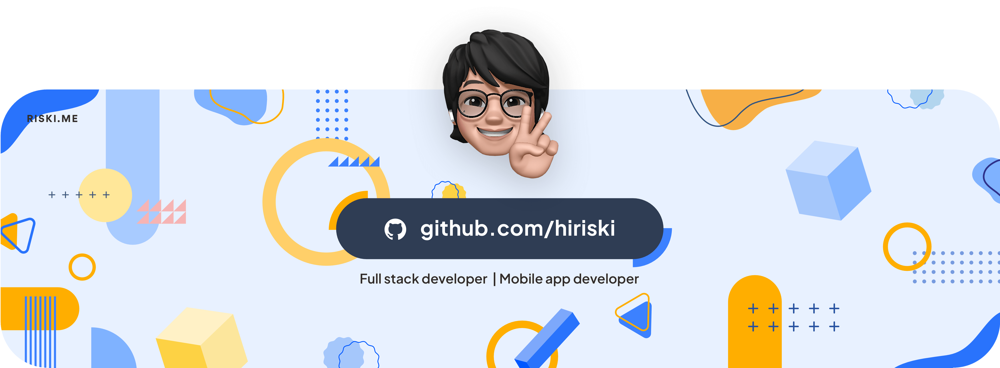
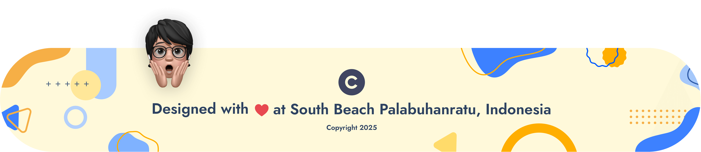

<!-- header banner -->

  <picture>
    <source media="(prefers-color-scheme: dark)" srcset="./banners/banner-header-dark.png">
    
  </picture>

### Hi there, I'm Riski! 👋

I'm a Full Stack Developer with 5+ years of experience passionate about building fast, responsive, and user-friendly web applications. With expertise in [ReactJS](https://react.dev/), [Next.JS](https://nextjs.org/), [Vue.JS](https://vuejs.org/), [Laravel](https://laravel.com/), and [Typescript](https://www.typescriptlang.org/), I specialize in crafting high-performance interfaces that enhance user experience and business growth. I currently work as a Senior Front-End Developer at a software company in Bandung, West Java, Indonesia.

### 👨🏻‍💻 What i do

I love turning ideas into reality. My journey in web and mobile app development with [React Native](https://reactnative.dev/) has led me to work on a variety of projects, from simple landing page application (SPA) to complex web applications. Whether I'm coding solo or collaborating with a team, I enjoy building interactive and user-friendly applications of course, by applying the concept of white clean, efficient, and maintainable code. Here you'll find a collection some of [my works](https://github.com/hiriski?tab=repositories), contributions, and maybe a few random thoughts😄, I hope to make a big footprint.

...oh there is one more thing, as a role as Front-end developer I also aware about design I like to create clean and modern graphic designs with Adobe Photoshop & Corel Draw, & Figma just to complete the visual design in my apps and github profile.

### 💪 Continuous learning

I believe in lifelong learning and am always on the lookout for new challenges to solve and technologies to master. I'm particularly interested in Native Mobile App Development, Custom ROMs and Kernel Development.

### 📚 Currently Learning

- **Next.js & [Framer Motion](https://motion.dev/)** to enhance my frontend skills
- **[React Native](https://reactnative.dev/), [React Native Reanimated](https://docs.swmansion.com/react-native-reanimated/) & [Native Modules](https://reactnative.dev/docs/turbo-native-modules-introduction)** to expanding of hybrid mobile apps development.
- **Advanced Laravel** to enhancing my backend API development skills.
- Deepening my understanding of OOP concepts with Typescript.

  <picture>
    <source media="(prefers-color-scheme: dark)" srcset="./banners/banner-quotes-dark.png">
    
  </picture>

### 👋 How to react me

I always open to connecting with fellow tech enthusiasts, whether it's for a project, sharing insights, or just a chat over coffee about the latest tech trends. Feel free to reach out!

- Email: **[hi@riski.me](mailto:hi@riski.me)** **|** **[hiriski@outlook.com](mailto:hiriski@outlook.com)**
- Instagram: **[zrkii](https://www.instagram.com/zrkii/)** (I'm rarely active on social media)

 

#### © Source and credits

**Fonts Used in the banner are** [Plus Jakarta Sans](https://fonts.google.com/specimen/Plus+Jakarta+Sans) and [Jost](https://fonts.google.com/specimen/Jost) you can find on Google Fonts API

**Avatar** using Apple avatar emoji in Macbook

 

  <picture>
    <source media="(prefers-color-scheme: dark)" srcset="./banners/banner-copyright-dark(2025).png">
    
  </picture>

